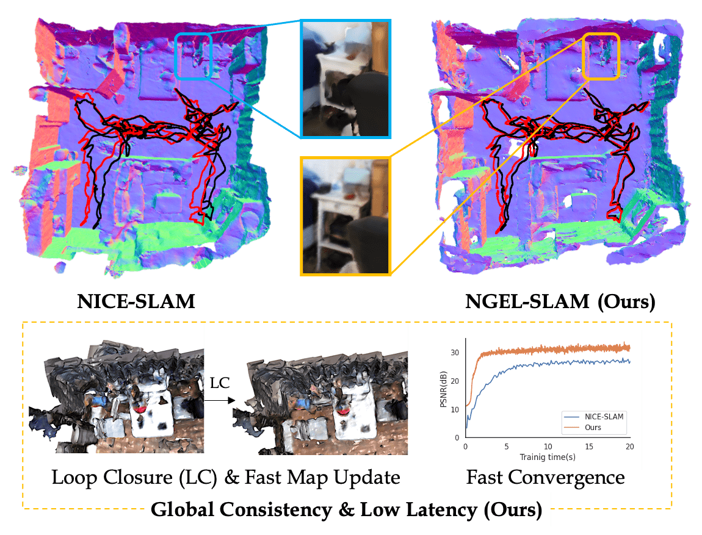

# NGEL-SLAM

### [Paper](https://arxiv.org/pdf/2311.09525.pdf) | [Video](https://www.bilibili.com/video/BV1W94y1G7gb/?share_source=copy_web&vd_source=e960221a1c45f15df36f53b3dce89e1c) | [Project Page]()

> NGEL-SLAM: Neural Implicit Representation-based Global Consistent Low-Latency SLAM System <br />
> Yunxuan Mao, Xuan Yu, Kai Wang, Yue Wang, Rong Xiong, Yiyi Liao<br />
> ICRA 2024

<p align="center">
  <a href="">
    
  </a>
</p>


## Installation

Please follow the instructions below to install the repo and dependencies.

```bash
mkdir catkin_ws && cd catkin_ws
mkdir src && cd src
git clone https://github.com/YunxuanMao/ngel_slam.git
cd ..
catkin_make
```
See [orb-slam3-ros](https://github.com/thien94/orb_slam3_ros) for more detail.

### Install the environment

```bash
conda create -n ngel python=3.8
conda activate ngel

pip install torch==1.10.1+cu113 torchvision==0.11.2+cu113 torchaudio==0.10.1 -f https://download.pytorch.org/whl/cu113/torch_stable.html

pip install -r requirements.txt

cd yx_kaolin
python setup.py develop
```

What's more, [kaolin-wisp](https://kaolin-wisp.readthedocs.io/en/latest/pages/install.html) should be installed.


## Data Preparation

You should put your data in `data` folder follow [NICE-SLAM](https://github.com/cvg/nice-slam) and generate a rosbag for ORB-SLAM3

```
python write_bag.py --input_folder '{PATH_TO_INPUT_FOLDER}' --output '{PATH_TO_ROSBAG}' --frame_id 'FRAME_ID_TO_DATA'
```
You should change the intrinsics manually in `write_bag.py`.

## Run

You should first start the ORB-SLAM3-ROS, and then using code below

```
python main.py --config '{PATH_TO_CONFIG}'  --input_folder '{PATH_TO_INPUT_FOLDER}' --output '{PATH_TO_OUTPUT}' 
```

## Citation

If you find our code or paper useful for your research, please consider citing:

```
@article{mao2023ngel,
  title={Ngel-slam: Neural implicit representation-based global consistent low-latency slam system},
  author={Mao, Yunxuan and Yu, Xuan and Wang, Kai and Wang, Yue and Xiong, Rong and Liao, Yiyi},
  journal={arXiv preprint arXiv:2311.09525},
  year={2023}
}
```